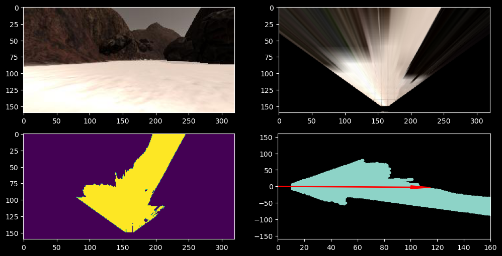

# RoboND-Rover-Project
This project is my solution the [Udacity Search and Sample Return Project](https://github.com/udacity/RoboND-Rover-Project).

---

## Notebook Analysis
In the project files, I have included a jupyter notebook. The purpose of this notebook is to play with the parameters to understand the general image analysis pipeline and to develop the basic functions associated with perception of the rover.

Here below we can see the steps from the camera of the rover:
- first the picture in front of the rover is captured.
- then it is projected to a top view.
- after that filters are used to identify navigable terrain, samples and obstacles.
- finally they are projected towards the local coordinates associated to the rover and mean direction is extracted.

---

### Projection of rover capture to world map
Once the pixels were identified in the local coordinates of the rover, we used their position to project them into the world map and mark the coordinates of explored area, using different colors for samples (green), ground (blue), and obstacles (red).

---

## Autonomous Navigation and Mapping
The main goal of this project is to get the preception data from the rover's camera, process it, and then control the movement of the rover autonomously. We can devide this process into two steps. The first step is the `perception_step`, and the second is the `decision_step`.

### Explanation of `perception_step` function
The `perception_step` function uses the camera associated with the rover to create a world map. It involves the following actions:
* A raw image is captured from the rover camera.
* A perspective transformation is then applied to convert it to a top view. It is calibrated initially by displaying a grid in front of the Rover.
* Some color threshold are applied to identify rocks, ground, and obstacles. Rocks are within a certain RGB range previously defined. Ground is light and is identified with pixels above a certain RGB threshold. Obstacles are the remaining pixels.
* The resulting points are converted to the rover local coordinates.
* The position and yaw of the rover are used to convert the previous local coordinates to world coordinates.
* Those positions are used to define polar coordinates as well as updating world coordinates.

**Note**: Prior to updating the world coordinates, we must ensure that the roll and pitch of the rover are low. We must also ensure that the points are not too far. It improves greatly the mapping accuracy.

### Explanation of `decision_step()` function
The `decision_step` function uses the processing performed in the previous perception step to decide what action the rover needs to take. It involves the following actions:
* If the rover is moving:
    * We check whether the path seems to be clear right ahead of us. This is performed by checking how many pixels are identified as being part of the navigable area.
    * If the path ahead is clear, we go full speed and accelerate unless we are already above the speed limit.
    * If the path ahead is not clear, we slow down and target to go to a stop.
    * The direction we follow when moving is calculated as the average angles. However, doing just this may (and most likely will) make the car miss some areas in the map. One way to force the car to visit all the map is to always take the left direction. This can be done by discarding some of the angles directed to the right.
    * The roll and pitch of the rover must be monitored to ensure we have a good mapping accuracy, occuring only when those values are low.
* If the rover is not moving:
    * We check if the path seems to be clear right ahead of us as per the previous methodology but with a higher threshold in term of number of pixels identified as being part of the navigable area.
    * If the path is clear, we start moving again.
    * If the path is not clear, we rotate towards the right. It ensures that we continue following the left wall, as done previously.
